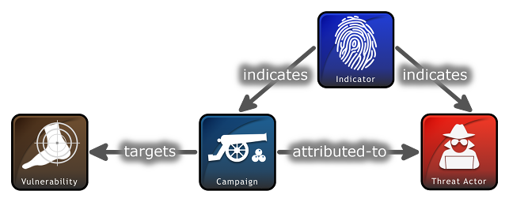

> `stixnet`
> C# API for STIX 2

## What is STIX?

### Introduction to STIX

Structured Threat Information Expression (STIX) is a language and serialization format used to exchange cyber threat intelligence (CTI). STIX enables organizations to share CTI with one another in a consistent and machine-readable manner, allowing security communities to better understand what computer-based attacks they are most likely to see and to anticipate and/or respond to those attacks faster and more effectively. STIX is designed to improve many different capabilities, such as collaborative threat analysis, automated threat exchange, automated detection and response, and more.
The objects and features added for inclusion in STIX 2.1 represent an iterative approach to fulfilling basic consumer and producer requirements for CTI sharing. Objects and properties not included in this version of STIX, but deemed necessary by the community, will be included in future releases.

STIX is a schema that defines a taxonomy of cyber threat intelligence that is represented by the following objects:

1. STIX Bundle Object : An object that provides a wrapper mechanism for packaging arbitrary STIX content together
2. STIX Objects
    1. STIX Core Objects
		1. STIX Domain Objects (SDO) : Higher Level Intelligence Objects that represent behaviors and constructs that threat analysts would typically create or work with while understanding the threat landscape.
		2. STIX Cyber-observable Objects (SCO) : Objects that represent observed facts about a network or host that may be used and related to higher level intelligence to form a more complete understanding of the threat landscape.
	    3. STIX Relationship Objects (SRO) : Objects that connect STIX Domain Objects together, STIX Cyber-observable Objects together, and connect STIX Domain Objects and STIX Cyber-observable Objects together to form a more complete understanding of the threat landscape.
	2. STIX Meta Objects (SMO) : A STIX Object that provides the necessary glue and associated metadata to enrich or extend STIX Core Objects to support user and system workflows.
		1. Extension Definition Objects
		2. Language Content Objects
		3. Marking Definition Objects

